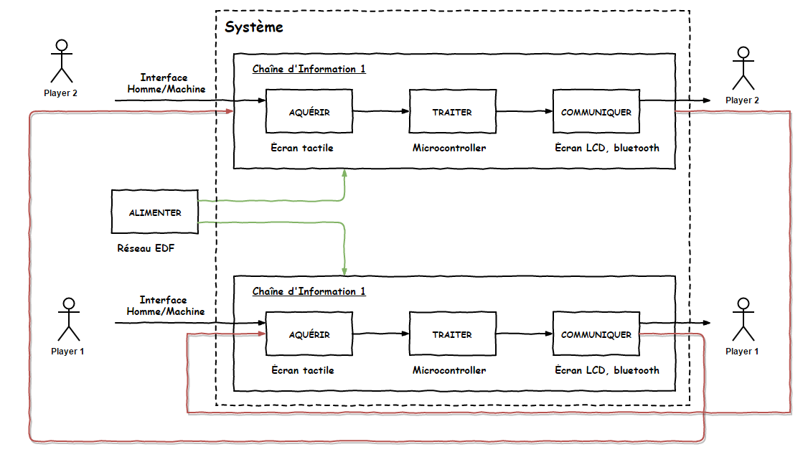

Bataille Navale Flowcode || 2016 - 2017
===================

Projet de SIN 2017-2018 <i class="icon-right-open"></i> **Bataille Navale**.

- **Candidat 1 (chef de projet)**: CHAMPAULT Jordan
- **Candidat 2**: THEVENIN Loélia
- **Candidat 3**: COLINET Cyril

> **Note:** Projet automatiquement sauvegardé (via git ou upload sur l'organisation)

Informations complémentaires
--------------------

### <i class="icon-bug"></i> Matériel utilisé

- Carte micro-controlleur Matrix (PIC-18F4520)
- Écran tactile
- Emmetteur / Récepteur bluetooth
- Flowcode =)

Diagrammes SysML
--------------------

### Diagramme de Contexte

### Diagramme d'Exigence

### Diagramme de Cas d'Utilisation

### Diagramme de Séquence

### Diagramme de définition de Blocs

Chaîne d'Information
--------------------

